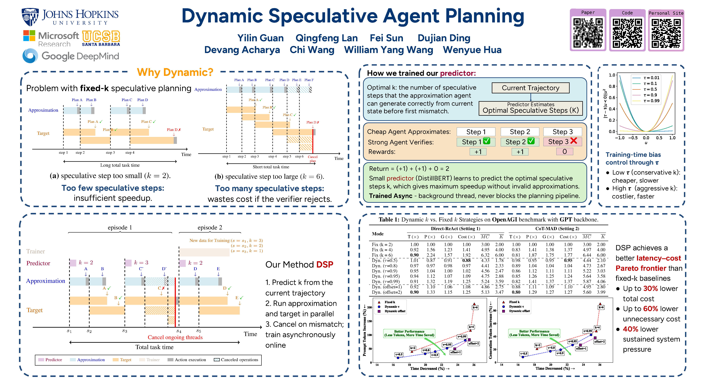
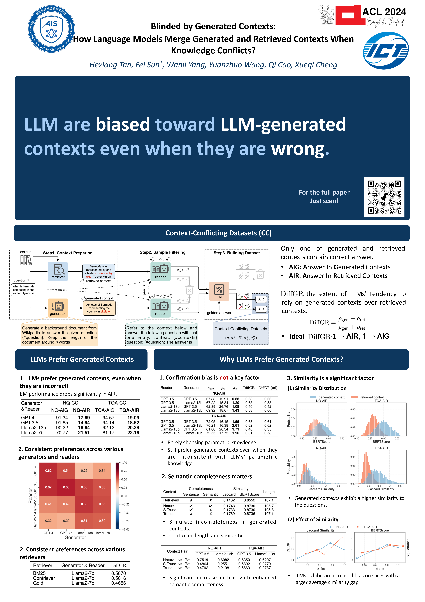
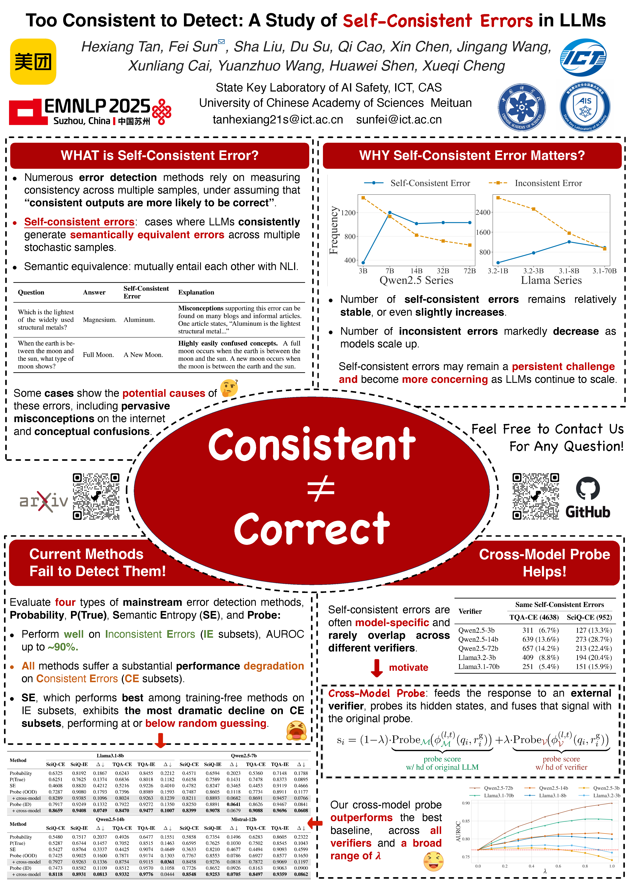
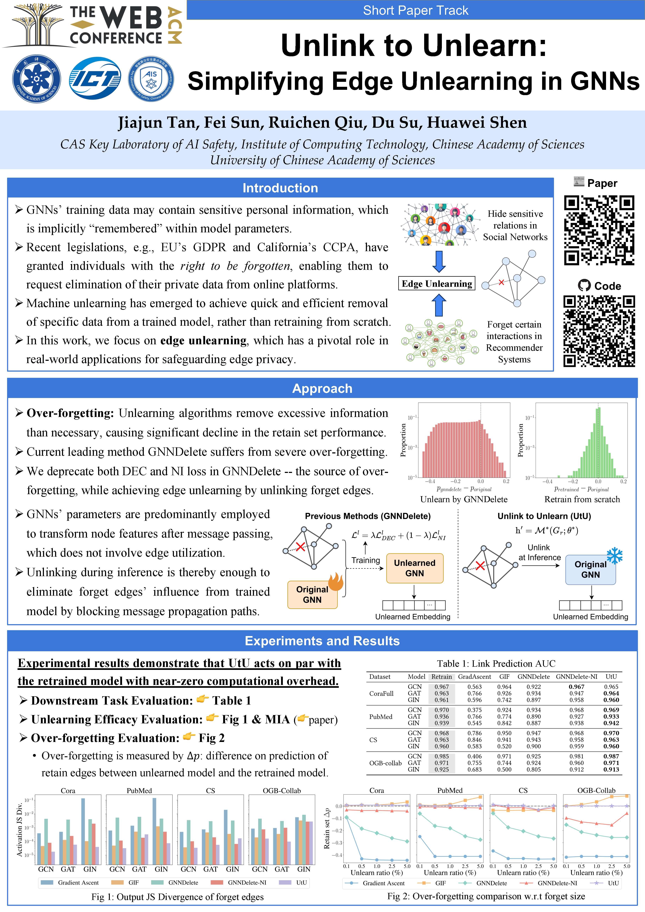

# 🌟 Awesome Star Posters

欢迎来到 **ICT-STAR** 学术海报素材库！

本仓库用于收集和存档小组内成员制作的各类学术海报（Poster）。建立本仓库的目的是：
1. **成果沉淀**：记录小组在各大顶级会议的展示记录。
2. **资源共享**：方便组内成员互相参考排版设计、配色方案及素材组件。
3. **快速上手**：为新入库同学提供开箱即用的模板。

---

## 📁 目录结构说明

为了方便管理和检索，请按照以下结构存放文件：

*   **/pptx/**: 存放使用 PowerPoint 制作的源文件 (`.pptx`)。
*   **/pdf/**: 存放所有poster的 **PDF 版本**（用于跨平台查看和直接打印）。
*   **/previews/**: 存放从 PDF 导出的预览图，供 README 快速展示效果。
*   **/latex/**: 存放使用 LaTeX/Beamer 或 Overleaf 导出的源文件包（若有，请打包成一个压缩包）。
*   **/others/**: 存放使用 Figma, Illustrator, Canva 等其他工具制作的源文件。
---

## 👀 Poster 效果图

下面的预览图由 `pdf/` 中的海报文件生成，方便大家快速浏览整体风格和版式。

### `ICLR_26_DSP_poster`

[PDF](pdf/ICLR_26_DSP_poster.pdf) · [PPTX](pptx/ICLR_26_DSP_poster.pptx)

### `blinded-by-generated-context`

[PDF](pdf/blinded-by-generated-context.pdf) · [PPTX](pptx/blinded-by-generated-context.pptx)

### `too-consistent-to-detect`

[PDF](pdf/too-consistent-to-detect.pdf) · [PPTX](pptx/too-consistent-to-detect.pptx)

### `unlink-to-unlearn`

[PDF](pdf/unlink-to-unlearn.pdf) · [PPTX](pptx/unlink-to-unlearn.pptx)

---

