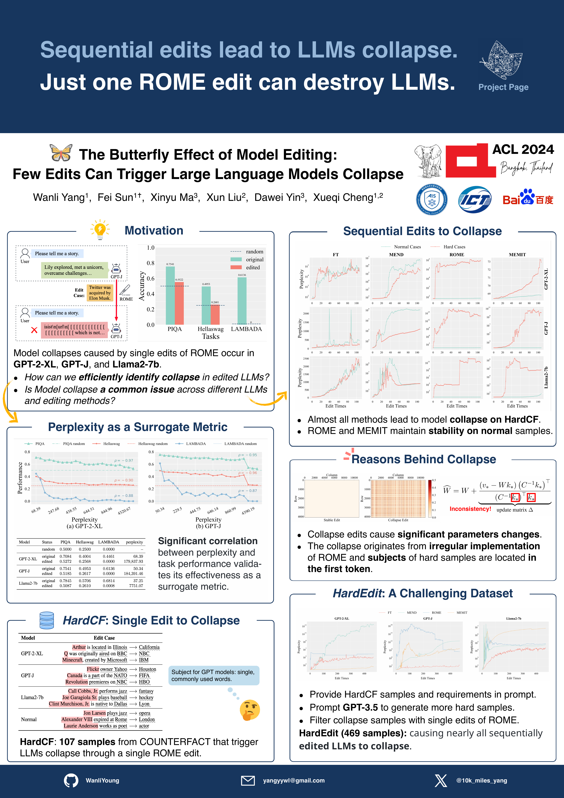
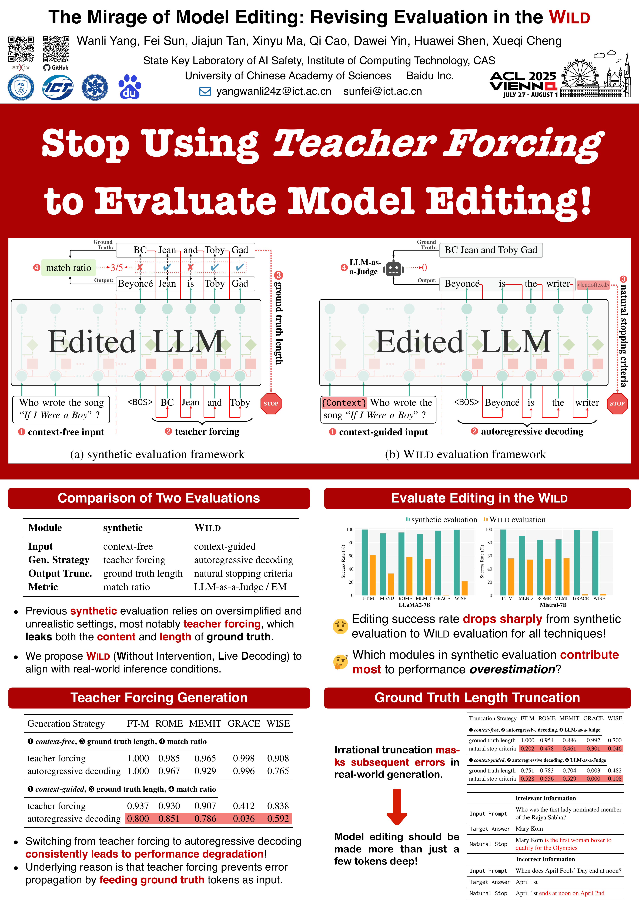
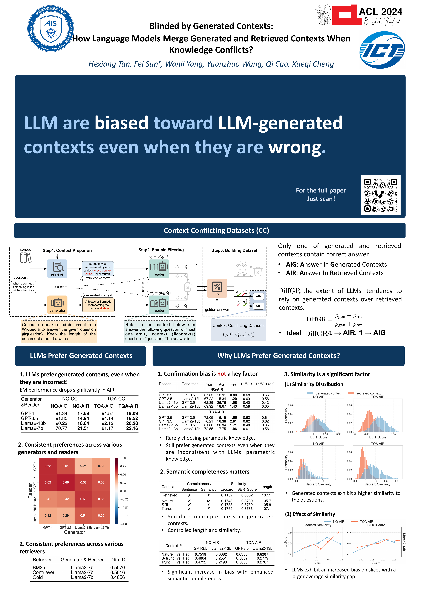
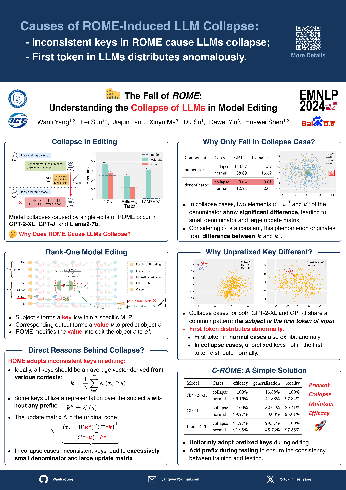
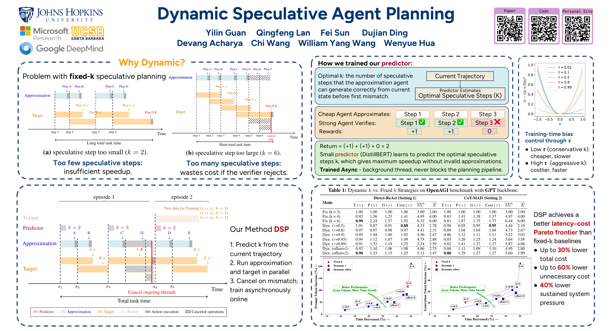
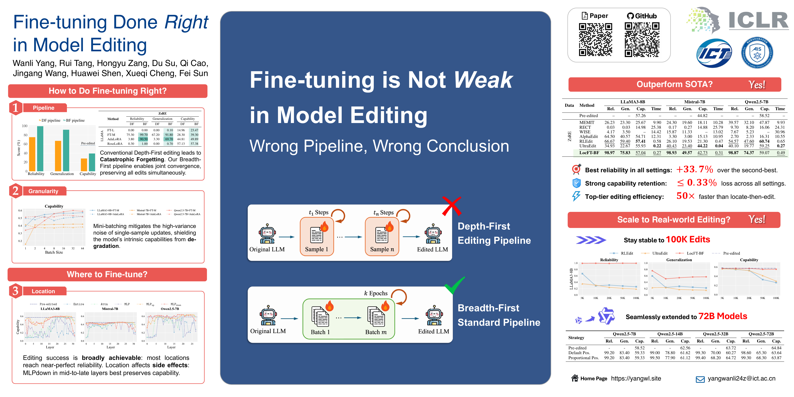
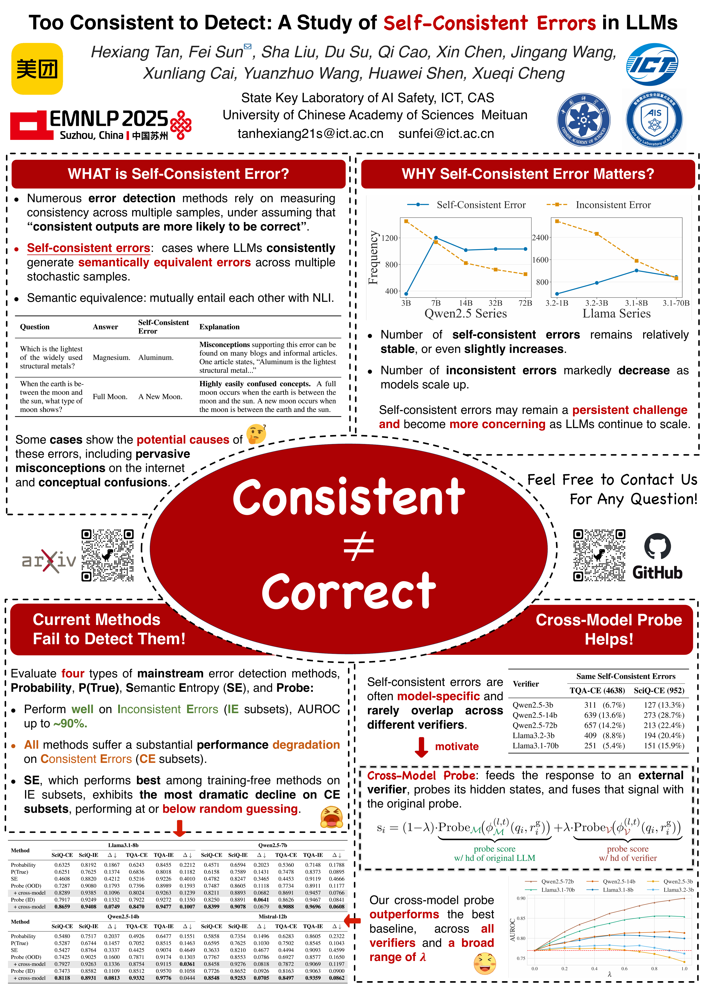
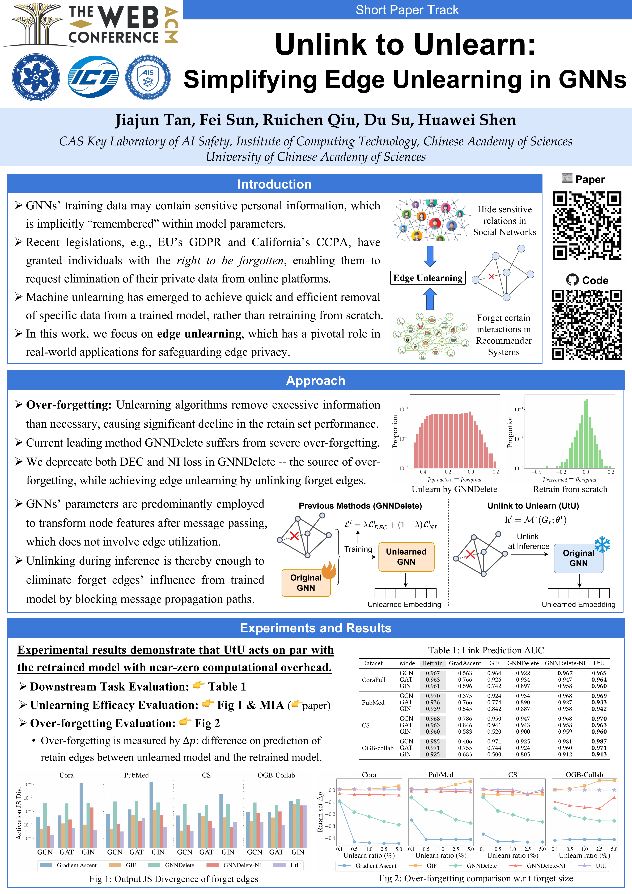

# 🌟 Awesome Star Posters

欢迎来到 **ICT-STAR** 学术海报素材库！

本仓库用于收集和存档小组内成员制作的各类学术海报（Poster）。建立本仓库的目的是：
1. **成果沉淀**：记录小组在各大顶级会议的展示记录。
2. **资源共享**：方便组内成员互相参考排版设计、配色方案及素材组件。
3. **快速上手**：为新入库同学提供开箱即用的模板。

---

## 📁 目录结构说明

为了方便管理和检索，请按照以下结构存放文件：

*   **/pptx/**: 存放使用 PowerPoint 制作的源文件 (`.pptx`)。
*   **/pdf/**: 存放所有poster的 **PDF 版本**（用于跨平台查看和直接打印）。
*   **/previews/**: 存放从 PDF 导出的预览图，供 README 快速展示效果。
*   **/latex/**: 存放使用 LaTeX/Beamer 或 Overleaf 导出的源文件包（若有，请打包成一个压缩包）。
*   **/others/**: 存放使用 Figma, Illustrator, Canva 等其他工具制作的源文件。
---

## 🔄 一键更新预览图

新增或修改 `pdf/` 中的 poster 后，运行下面的脚本即可重新生成 `previews/` 并刷新本 README 的效果图列表：

```bash
./scripts/update_previews.py
```

可选参数：

*   `--missing-only`: 只生成缺失的预览图。
*   `--clean`: 删除已没有对应 PDF 的旧预览图。
*   `--dpi 110`: 指定渲染清晰度，默认 110。

## 👀 Poster 效果图

下面的预览图由 `scripts/update_previews.py` 根据 `pdf/` 中的海报文件生成，方便大家快速浏览整体风格和版式。

<!-- previews:start -->
### `acl24_poster_ywl_v6`

[PDF](pdf/acl24_poster_ywl_v6.pdf) · [PPTX](pptx/acl24_poster_ywl_v6.pptx)



### `acl25_poster_rethinking_ywl`

[PDF](pdf/acl25_poster_rethinking_ywl.pdf) · [PPTX](pptx/acl25_poster_rethinking_ywl.pptx)



### `blinded-by-generated-context`

[PDF](pdf/blinded-by-generated-context.pdf) · [PPTX](pptx/blinded-by-generated-context.pptx)



### `emnlp24_poster_ywl_v2`

[PDF](pdf/emnlp24_poster_ywl_v2.pdf) · [PPTX](pptx/emnlp24_poster_ywl_v2.pptx)



### `ICLR_26_DSP_poster`

[PDF](pdf/ICLR_26_DSP_poster.pdf) · [PPTX](pptx/ICLR_26_DSP_poster.pptx)



### `iclr_26_ywl`

[PDF](pdf/iclr_26_ywl.pdf) · [PPTX](pptx/iclr_26_ywl.pptx)



### `too-consistent-to-detect`

[PDF](pdf/too-consistent-to-detect.pdf) · [PPTX](pptx/too-consistent-to-detect.pptx)



### `unlink-to-unlearn`

[PDF](pdf/unlink-to-unlearn.pdf) · [PPTX](pptx/unlink-to-unlearn.pptx)


<!-- previews:end -->
---
